# Elementene i ADDML 8.3

I det etterfølgende er hvert enkelt element i ADDML beskrevet.

Hvert element har en figur som viser hvilke andre elementer det har en relasjon til, både som overliggende element og eventuelle underliggende element.

I tabellform er det gitt grunnleggende informasjon om elementet. Og deretter i en ny tabell alle attributter som elementet har. Også underliggende element er vist i en tabellform.

Til slutt er det vist et enkelt eksempel med bruk av elementet. For noen element er det vist til eksempler under andre element.

## addml  <a id="addml"/>
På toppnivået er det kun ett element - addml.

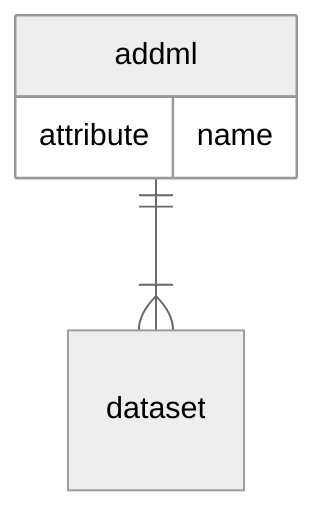

| Elementnavn | Beskrivelse |
| :-- | :-- |
| addml | name angir navnet til denne addml-filen. Det er ingen krav til navnsetting i utgangspunktet. |

| Attributt | Forekomst | Beskrivelse |
| :-- | :-- | :-- |
| name | 0-1 | name angir navnet til denne addml-filen. Det er ingen krav til navnsetting i utgangspunktet. |

| Underliggende elementer | Forekomster |
| :-- |  :-- |
| [dataset](#dataset) | 1-n |

Ingen overordnede elementer.

## dataset  <a id="dataset"/>
Hovednivået dataset som tilsvarer et datasett har også bare ett enkelt element. Til gjengjeld kan dette forekomme flere ganger.

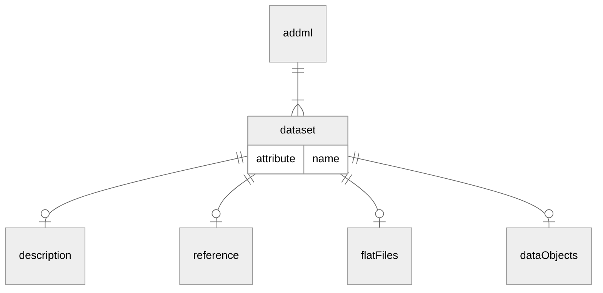

| Overordnede elementer | Forekomster av element |
| :-- |  :-- |
| [addml](#addml) | 1-n |

| Elementnavn | Beskrivelse |
| :-- | :-- |
| dataset | name angir navnet til det spesifikke datasettet. Det er ingen krav til navnsetting i utgangspunktet, men navnene for samme type objekt må være unike innen en addml-fil. |

| Attributt | Forekomst | Beskrivelse |
| :-- | :-- | :-- |
| name | 0-1 | name angir navnet til det spesifikke datasettet. Det er ingen krav til navnsetting i utgangspunktet, men navnene for samme type objekt må være unike innen en addml-fil. |

| Underliggende elementer | Forekomster |
| :-- |  :-- |
| [description](#description) | 0-1 |
| [reference](#reference) | 0-1 |
| [flatFiles](#flatFiles) | 0-1 |
| [dataObjects](#dataObjects) | 0-1 |

## reference  <a id="reference"/>

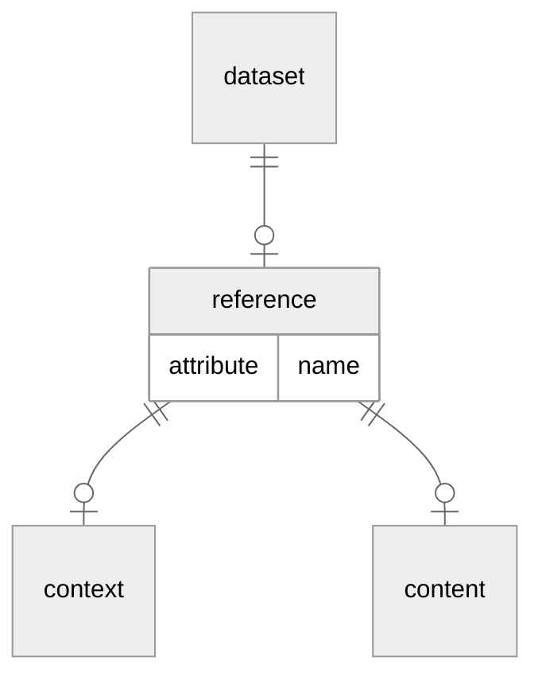

| Overordnede elementer | Forekomster av element |
| :-- |  :-- |
| [dataset](#dataset) | 0-1 |

| Elementnavn | Beskrivelse |
| :-- | :-- |
| reference | name angir navnet til det spesifikke referanseobjektet. Det er ingen krav til navnsetting i utgangspunktet, men navnene for samme type objekt må være unike innen en addml-fil. |

| Attributt | Forekomst | Beskrivelse |
| :-- | :-- | :-- |
| name | 0-1 | name angir navnet til det spesifikke referanseobjektet. Det er ingen krav til navnsetting i utgangspunktet, men navnene for samme type objekt må være unike innen en addml-fil. |

| Underliggende elementer | Forekomster |
| :-- |  :-- |
| [context](#context) | 0-1 |
| [content](#content) | 0-1 |

## context  <a id="context"/>

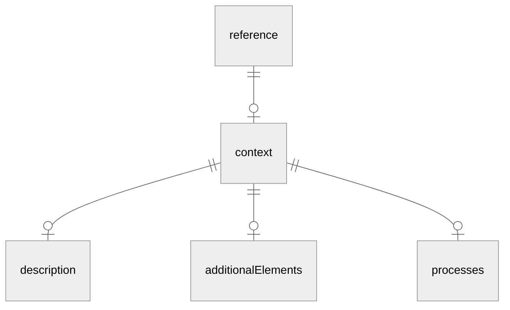

| Overordnede elementer | Forekomster av element |
| :-- |  :-- |
| [reference](#reference) | 0-1 |

| Elementnavn | Beskrivelse |
| :-- | :-- |
| context | context inneholder informasjon av kontekstuell art om avleveringen. Hva slags informasjon som skal være med under context må brukeren selv definere ved hjelp av additionalElement. |

| Underliggende elementer | Forekomster |
| :-- |  :-- |
| [description](#description) | 0-1 |
| [additionalElements](#additionalElements) | 0-1 |
| [processes](#processes) | 0-1 |

Ingen attributter.

## content  <a id="content"/>

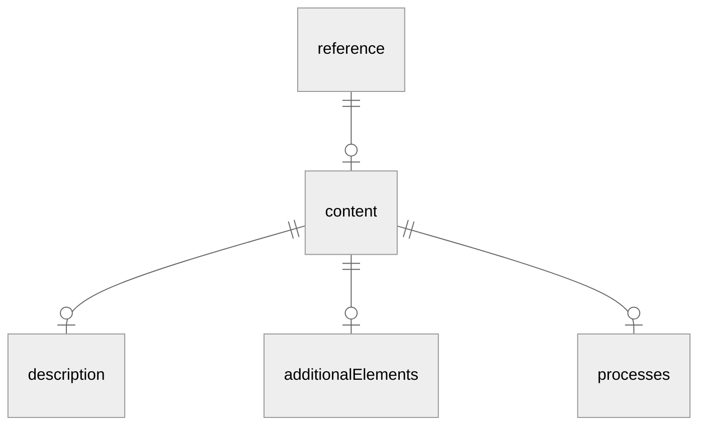

| Overordnede elementer | Forekomster av element |
| :-- |  :-- |
| [reference](#reference) | 0-1 |

| Elementnavn | Beskrivelse |
| :-- | :-- |
| content | content inneholder informasjon av innholdsmessig art om avleveringen. Hva slags informasjon som skal være med under content må brukeren selv definere ved hjelp av additionalElement. |

| Underliggende elementer | Forekomster |
| :-- |  :-- |
| [description](#description) | 0-1 |
| [additionalElements](#additionalElements) | 0-1 |
| [processes](#processes) | 0-1 |

Ingen attributter.

## flatFiles  <a id="flatFiles"/>

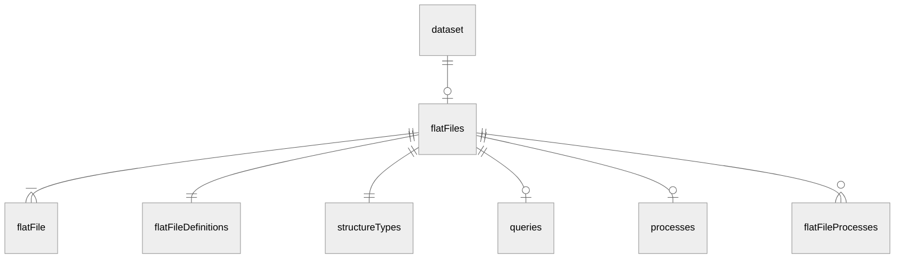

| Overordnede elementer | Forekomster av element |
| :-- |  :-- |
| [dataset](#dataset) | 0-1 |

| Elementnavn | Beskrivelse |
| :-- | :-- |
| flatFiles |  |

| Underliggende elementer | Forekomster |
| :-- |  :-- |
| [flatFile](#flatFile) | 1-n |
| [flatFileDefinitions](#flatFileDefinitions) | 1 |
| [structureTypes](#structureTypes) | 1 |
| [queries](#queries) | 0-1 |
| [processes](#processes) | 0-1 |
| [flatFileProcesses](#flatFileProcesses) | 0-n |

Ingen attributter.

## flatFile  <a id="flatFile"/>

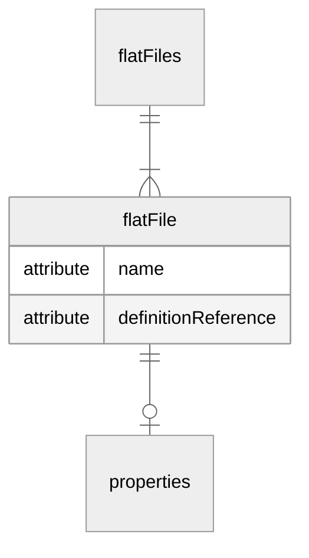

| Overordnede elementer | Forekomster av element |
| :-- |  :-- |
| [flatFiles](#flatFiles) | 1-n |

| Elementnavn | Beskrivelse |
| :-- | :-- |
| flatFile | Referanse til flatFileDefinition, en referanse som kan være mange til en. |

| Attributt | Forekomst | Beskrivelse |
| :-- | :-- | :-- |
| name | 0-1 | name angir navnet til det spesifikke objekt. Det er ingen krav til navnsetting i utgangspunktet, men navnene for samme type objekt må være unike innen en addml-fil. |
| definitionReference | 0-1 | Referanse til flatFileDefinition, en referanse som kan være mange til en. |

| Underliggende elementer | Forekomster |
| :-- |  :-- |
| [properties](#properties) | 0-1 |

## flatFileDefinitions  <a id="flatFileDefinitions"/>

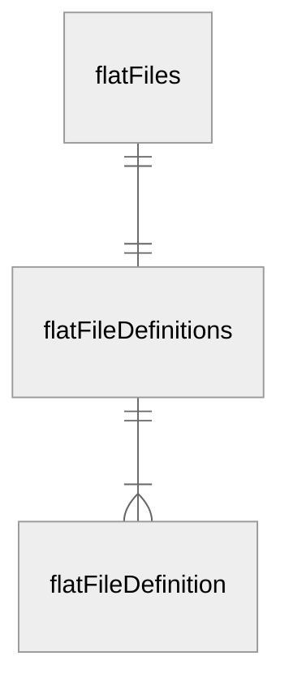

| Overordnede elementer | Forekomster av element |
| :-- |  :-- |
| [flatFiles](#flatFiles) | 1 |

| Elementnavn | Beskrivelse |
| :-- | :-- |
| flatFileDefinitions |  |

| Underliggende elementer | Forekomster |
| :-- |  :-- |
| [flatFileDefinition](#flatFileDefinition) | 1-n |

Ingen attributter.

## flatFileDefinition  <a id="flatFileDefinition"/>

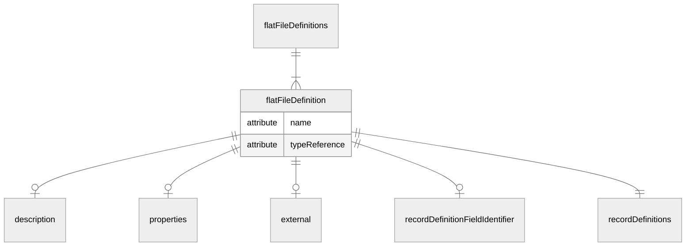

| Overordnede elementer | Forekomster av element |
| :-- |  :-- |
| [flatFileDefinitions](#flatFileDefinitions) | 1-n |

| Elementnavn | Beskrivelse |
| :-- | :-- |
| flatFileDefinition | Referanse til flatFileType, en referanse som kan være mange til en. |

| Attributt | Forekomst | Beskrivelse |
| :-- | :-- | :-- |
| name | 0-1 | name angir navnet til det spesifikke objekt. Det er ingen krav til navnsetting i utgangspunktet, men navnene for samme type objekt må være unike innen en addml-fil. |
| typeReference | 0-1 | Referanse til flatFileType, en referanse som kan være mange til en. |

| Underliggende elementer | Forekomster |
| :-- |  :-- |
| [description](#description) | 0-1 |
| [properties](#properties) | 0-1 |
| [external](#external) | 0-1 |
| [recordDefinitionFieldIdentifier](#recordDefinitionFieldIdentifier) | 0-1 |
| [recordDefinitions](#recordDefinitions) | 1 |

## external  <a id="external"/>
I noen tilfeller er det behov for å knytte et datauttrekk til et annet. Det er da definert to elementer i ADDML som er tenkt å benyttes til dette formålet. Elementene er external som angir at den filen som her defineres ikke er med i selve datauttrekket, og incomplete som angir at definisjonen ikke er komplett. Tanken er at man for eksterne filer bare definerer de elementene som er nødvendig for å opprette referanser mellom filen som defineres utenfra og de interne filene.
Et eksempel på en slik kobling kan være at man i uttrekket definerer postkatalogen som en ekstern fil. Dette fordi den benyttes av flere systemer samtidig. Samtidig er det også opprettet referanser (nøkler) fra interne elementer med postnr til denne eksterne postkatalogen.

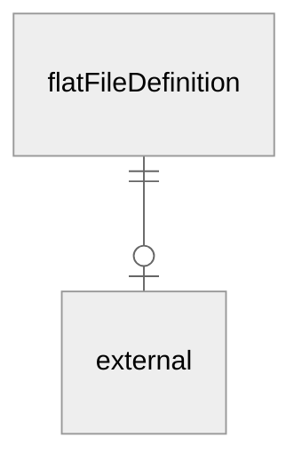

| Overordnede elementer | Forekomster av element |
| :-- |  :-- |
| [flatFileDefinition](#flatFileDefinition) | 0-1 |

| Elementnavn | Beskrivelse |
| :-- | :-- |
| external | Dette elementet benyttes når det er referanser til filer som ikke er med i uttrekket. Elementet er da et flagg som benyttes for å angi at filen ikke er med.  |

Ingen attributter eller underordnede elementer.

## recordDefinitionFieldIdentifier  <a id="recordDefinitionFieldIdentifier"/>

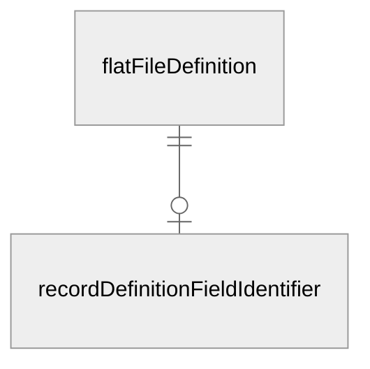

| Overordnede elementer | Forekomster av element |
| :-- |  :-- |
| [flatFileDefinition](#flatFileDefinition) | 0-1 |

| Elementnavn | Beskrivelse |
| :-- | :-- |
| recordDefinitionFieldIdentifier |  |

Ingen attributter eller underordnede elementer.

## recordDefinitions  <a id="recordDefinitions"/>

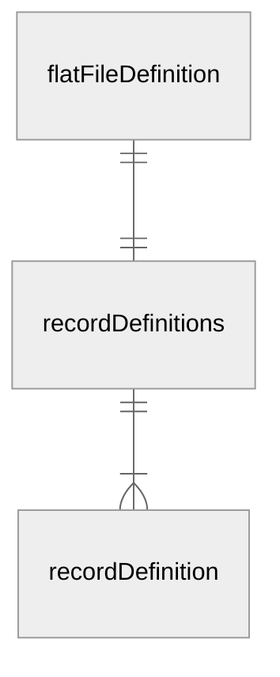

| Overordnede elementer | Forekomster av element |
| :-- |  :-- |
| [flatFileDefinition](#flatFileDefinition) | 1 |

| Elementnavn | Beskrivelse |
| :-- | :-- |
| recordDefinitions |  |

| Underliggende elementer | Forekomster |
| :-- |  :-- |
| [recordDefinition](#recordDefinition) | 1-n |

Ingen attributter.

## recordDefinition  <a id="recordDefinition"/>

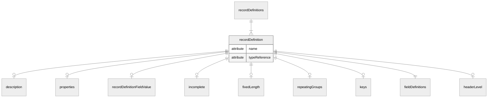

| Overordnede elementer | Forekomster av element |
| :-- |  :-- |
| [recordDefinitions](#recordDefinitions) | 1-n |

| Elementnavn | Beskrivelse |
| :-- | :-- |
| recordDefinition | Referanse til recordType. Kun påkrevd om ledende nuller eller etterfølgende og ledende blanke tegn er fjernet. |

| Attributt | Forekomst | Beskrivelse |
| :-- | :-- | :-- |
| name | 0-1 | name angir navnet til det spesifikke objekt. Det er ingen krav til navnsetting i utgangspunktet, men navnene for samme type objekt må være unike innen en addml-fil. |
| typeReference | 0-1 | Referanse til recordType. Kun påkrevd om ledende nuller eller etterfølgende og ledende blanke tegn er fjernet. |

| Underliggende elementer | Forekomster |
| :-- |  :-- |
| [description](#description) | 0-1 |
| [properties](#properties) | 0-1 |
| [recordDefinitionFieldValue](#recordDefinitionFieldValue) | 0-1 |
| [incomplete](#incomplete) | 0-1 |
| [fixedLength](#fixedLength) | 0-1 |
| [repeatingGroups](#repeatingGroups) | 0-1 |
| [keys](#keys) | 0-1 |
| [fieldDefinitions](#fieldDefinitions) | 1 |
| [headerLevel](#headerLevel) | 0-1 |

## recordDefinitionFieldValue  <a id="recordDefinitionFieldValue"/>

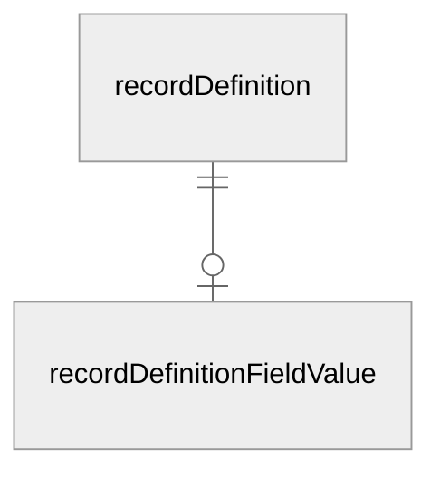

| Overordnede elementer | Forekomster av element |
| :-- |  :-- |
| [recordDefinition](#recordDefinition) | 0-1 |

| Elementnavn | Beskrivelse |
| :-- | :-- |
| recordDefinitionFieldValue |  |

Ingen attributter eller underordnede elementer.

## incomplete  <a id="incomplete"/>

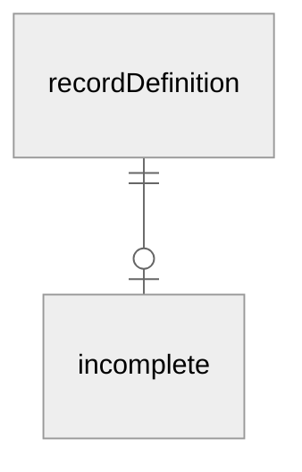

| Overordnede elementer | Forekomster av element |
| :-- |  :-- |
| [recordDefinition](#recordDefinition) | 0-1 |

| Elementnavn | Beskrivelse |
| :-- | :-- |
| incomplete |  |

Ingen attributter eller underordnede elementer.

## fixedLength  <a id="fixedLength"/>

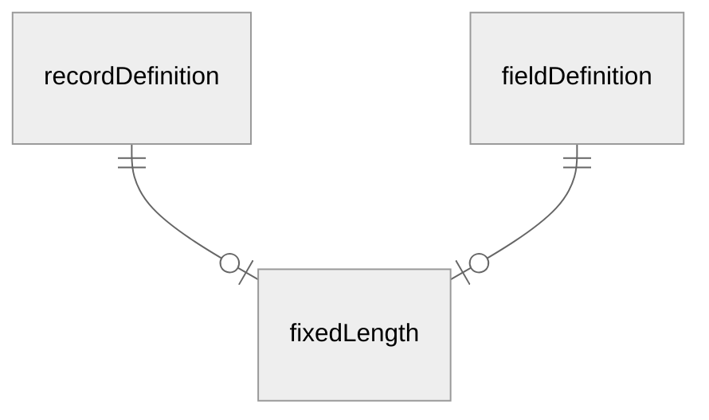

| Overordnede elementer | Forekomster av element |
| :-- |  :-- |
| [recordDefinition](#recordDefinition) | 0-1 |
| [fieldDefinition](#fieldDefinition) | 0-1 |

| Elementnavn | Beskrivelse |
| :-- | :-- |
| fixedLength |  |

Ingen attributter eller underordnede elementer.

## repeatingGroups  <a id="repeatingGroups"/>

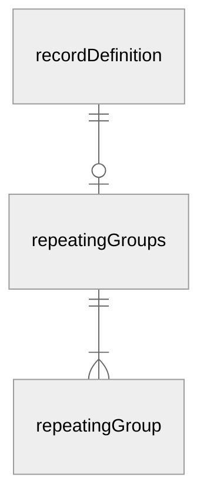

| Overordnede elementer | Forekomster av element |
| :-- |  :-- |
| [recordDefinition](#recordDefinition) | 0-1 |

| Elementnavn | Beskrivelse |
| :-- | :-- |
| repeatingGroups |  |

| Underliggende elementer | Forekomster |
| :-- |  :-- |
| [repeatingGroup](#repeatingGroup) | 1-n |

Ingen attributter.

## repeatingGroup  <a id="repeatingGroup"/>

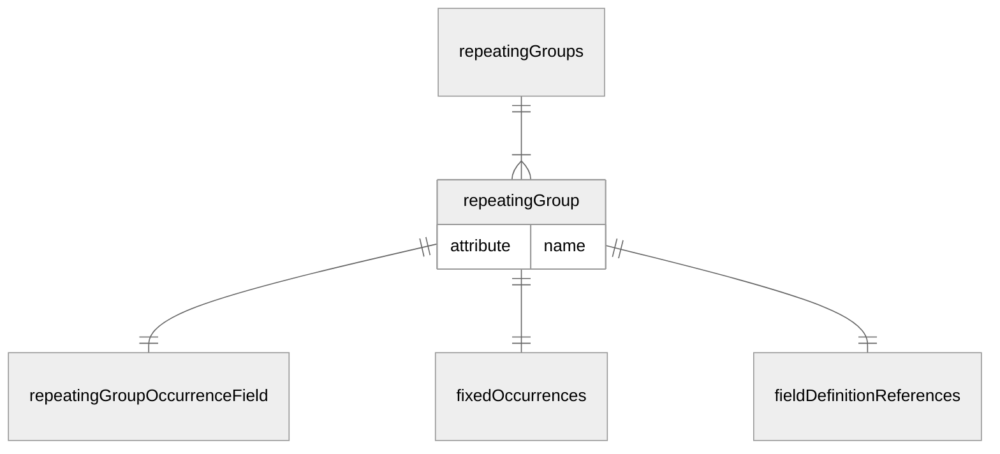

| Overordnede elementer | Forekomster av element |
| :-- |  :-- |
| [repeatingGroups](#repeatingGroups) | 1-n |

| Elementnavn | Beskrivelse |
| :-- | :-- |
| repeatingGroup | name angir navnet til det spesifikke objekt. Det er ingen krav til navnsetting i utgangspunktet, men navnene for samme type objekt må være unike innen en addml-fil. |

| Attributt | Forekomst | Beskrivelse |
| :-- | :-- | :-- |
| name | 0-1 | name angir navnet til det spesifikke objekt. Det er ingen krav til navnsetting i utgangspunktet, men navnene for samme type objekt må være unike innen en addml-fil. |

| Underliggende elementer | Forekomster |
| :-- |  :-- |
| [repeatingGroupOccurrenceField](#repeatingGroupOccurrenceField) | 1 |
| [fixedOccurrences](#fixedOccurrences) | 1 |
| [fieldDefinitionReferences](#fieldDefinitionReferences) | 1 |

## repeatingGroupOccurrenceField  <a id="repeatingGroupOccurrenceField"/>

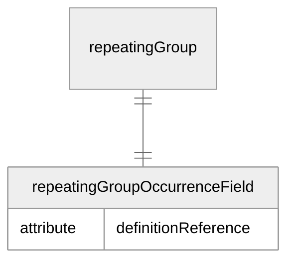

| Overordnede elementer | Forekomster av element |
| :-- |  :-- |
| [repeatingGroup](#repeatingGroup) | 1 |

| Elementnavn | Beskrivelse |
| :-- | :-- |
| repeatingGroupOccurrenceField | Referanse til fieldDefinition. |

| Attributt | Forekomst | Beskrivelse |
| :-- | :-- | :-- |
| definitionReference | 0-1 | Referanse til fieldDefinition. |

Ingen underordnede elementer.

## fixedOccurrences  <a id="fixedOccurrences"/>

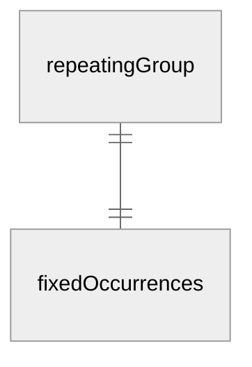

| Overordnede elementer | Forekomster av element |
| :-- |  :-- |
| [repeatingGroup](#repeatingGroup) | 1 |

| Elementnavn | Beskrivelse |
| :-- | :-- |
| fixedOccurrences |  |

Ingen attributter eller underordnede elementer.

## keys  <a id="keys"/>

```mermaid
%%{init: {'er':{'minEntityHeight':false,'minEntityWidth':false},'theme':'neutral'}}%%
erDiagram
p1[recordDefinition]
c1[key]
e[keys] {
}
p1 ||--o| e: ""
e ||--|{ c1: ""
```

| Overordnede elementer | Forekomster av element |
| :-- |  :-- |
| [recordDefinition](#recordDefinition) | 0-1 |

| Elementnavn | Beskrivelse |
| :-- | :-- |
| keys |  |

| Underliggende elementer | Forekomster |
| :-- |  :-- |
| [key](#key) | 1-n |

Ingen attributter.

## key  <a id="key"/>

```mermaid
%%{init: {'er':{'minEntityHeight':false,'minEntityWidth':false},'theme':'neutral'}}%%
erDiagram
p1[keys]
c1[primaryKey]
c2[alternateKey]
c3[foreignKey]
c4[fieldDefinitionReferences]
e[key] {
attribute name
}
p1 ||--|{ e: ""
e ||--|| c1: ""
e ||--|| c2: ""
e ||--|| c3: ""
e ||--|| c4: ""
```

| Overordnede elementer | Forekomster av element |
| :-- |  :-- |
| [keys](#keys) | 1-n |

| Elementnavn | Beskrivelse |
| :-- | :-- |
| key | name angir navnet til det spesifikke objekt. Det er ingen krav til navnsetting i utgangspunktet, men navnene for samme type objekt må være unike innen en addml-fil. |

| Attributt | Forekomst | Beskrivelse |
| :-- | :-- | :-- |
| name | 0-1 | name angir navnet til det spesifikke objekt. Det er ingen krav til navnsetting i utgangspunktet, men navnene for samme type objekt må være unike innen en addml-fil. |

| Underliggende elementer | Forekomster |
| :-- |  :-- |
| [primaryKey](#primaryKey) | 1 |
| [alternateKey](#alternateKey) | 1 |
| [foreignKey](#foreignKey) | 1 |
| [fieldDefinitionReferences](#fieldDefinitionReferences) | 1 |

## primaryKey  <a id="primaryKey"/>

```mermaid
%%{init: {'er':{'minEntityHeight':false,'minEntityWidth':false},'theme':'neutral'}}%%
erDiagram
p1[key]
e[primaryKey] {
}
p1 ||--|| e: ""
```

| Overordnede elementer | Forekomster av element |
| :-- |  :-- |
| [key](#key) | 1 |

| Elementnavn | Beskrivelse |
| :-- | :-- |
| primaryKey |  |

Ingen attributter eller underordnede elementer.

## alternateKey  <a id="alternateKey"/>

```mermaid
%%{init: {'er':{'minEntityHeight':false,'minEntityWidth':false},'theme':'neutral'}}%%
erDiagram
p1[key]
e[alternateKey] {
}
p1 ||--|| e: ""
```

| Overordnede elementer | Forekomster av element |
| :-- |  :-- |
| [key](#key) | 1 |

| Elementnavn | Beskrivelse |
| :-- | :-- |
| alternateKey | Dette elementet benyttes for å angi alternative nøkler. I praksis vil dette gi muligheten for å angi indekser. Selve elementet er kun et flagg. |

Ingen attributter eller underordnede elementer.

## foreignKey  <a id="foreignKey"/>

```mermaid
%%{init: {'er':{'minEntityHeight':false,'minEntityWidth':false},'theme':'neutral'}}%%
erDiagram
p1[key]
c1[flatFileDefinitionReference]
c2[relationType]
e[foreignKey] {
}
p1 ||--|| e: ""
e ||--|| c1: ""
e ||--|| c2: ""
```

| Overordnede elementer | Forekomster av element |
| :-- |  :-- |
| [key](#key) | 1 |

| Elementnavn | Beskrivelse |
| :-- | :-- |
| foreignKey |  |

| Underliggende elementer | Forekomster |
| :-- |  :-- |
| [flatFileDefinitionReference](#flatFileDefinitionReference) | 1 |
| [relationType](#relationType) | 1 |

Ingen attributter.

## relationType  <a id="relationType"/>

```mermaid
%%{init: {'er':{'minEntityHeight':false,'minEntityWidth':false},'theme':'neutral'}}%%
erDiagram
p1[foreignKey]
e[relationType] {
}
p1 ||--|| e: ""
```

| Overordnede elementer | Forekomster av element |
| :-- |  :-- |
| [foreignKey](#foreignKey) | 1 |

| Elementnavn | Beskrivelse |
| :-- | :-- |
| relationType |  |

Ingen attributter eller underordnede elementer.

## fieldDefinitions  <a id="fieldDefinitions"/>

```mermaid
%%{init: {'er':{'minEntityHeight':false,'minEntityWidth':false},'theme':'neutral'}}%%
erDiagram
p1[recordDefinition]
c1[fieldDefinition]
e[fieldDefinitions] {
}
p1 ||--|| e: ""
e ||--|{ c1: ""
```

| Overordnede elementer | Forekomster av element |
| :-- |  :-- |
| [recordDefinition](#recordDefinition) | 1 |

| Elementnavn | Beskrivelse |
| :-- | :-- |
| fieldDefinitions |  |

| Underliggende elementer | Forekomster |
| :-- |  :-- |
| [fieldDefinition](#fieldDefinition) | 1-n |

Ingen attributter.

## fieldDefinition  <a id="fieldDefinition"/>
I ADDML er det tre parallelle informasjonstyper, den øverste er den generelle typen, hvor basis informasjon om felter defineres. Deretter kommer definisjonen av det enkelt felt, hvor man for mer eksplisitt informasjon om et felt og til slutt det fysiske delen som dog bare er på filnivå. Elementet som forklares her er på definisjonslaget.

```mermaid
%%{init: {'er':{'minEntityHeight':false,'minEntityWidth':false},'theme':'neutral'}}%%
erDiagram
p1[fieldDefinitions]
p2[fieldParts]
c1[description]
c2[properties]
c3[startPos]
c4[endPos]
c5[fixedLength]
c6[minLength]
c7[maxLength]
c8[unique]
c9[notNull]
c10[fieldParts]
c11[codes]
e[fieldDefinition] {
attribute name
attribute typeReference
}
p1 ||--|{ e: ""
p2 ||--|{ e: ""
e ||--o| c1: ""
e ||--o| c2: ""
e ||--o| c3: ""
e ||--o| c4: ""
e ||--o| c5: ""
e ||--o| c6: ""
e ||--o| c7: ""
e ||--o| c8: ""
e ||--o| c9: ""
e ||--o| c10: ""
e ||--o| c11: ""
```

| Overordnede elementer | Forekomster av element |
| :-- |  :-- |
| [fieldDefinitions](#fieldDefinitions) | 1-n |
| [fieldParts](#fieldParts) | 1-n |

| Elementnavn | Beskrivelse |
| :-- | :-- |
| fieldDefinition | Referanse til fieldType. |

| Attributt | Forekomst | Beskrivelse |
| :-- | :-- | :-- |
| name | 0-1 | name angir navnet til det spesifikke objekt. Det er ingen krav til navnsetting i utgangspunktet, men navnene for samme type objekt må være unike innen en addml-fil. |
| typeReference | 0-1 | Referanse til fieldType. |

| Underliggende elementer | Forekomster |
| :-- |  :-- |
| [description](#description) | 0-1 |
| [properties](#properties) | 0-1 |
| [startPos](#startPos) | 0-1 |
| [endPos](#endPos) | 0-1 |
| [fixedLength](#fixedLength) | 0-1 |
| [minLength](#minLength) | 0-1 |
| [maxLength](#maxLength) | 0-1 |
| [unique](#unique) | 0-1 |
| [notNull](#notNull) | 0-1 |
| [fieldParts](#fieldParts) | 0-1 |
| [codes](#codes) | 0-1 |

## startPos  <a id="startPos"/>

```mermaid
%%{init: {'er':{'minEntityHeight':false,'minEntityWidth':false},'theme':'neutral'}}%%
erDiagram
p1[fieldDefinition]
e[startPos] {
}
p1 ||--o| e: ""
```

| Overordnede elementer | Forekomster av element |
| :-- |  :-- |
| [fieldDefinition](#fieldDefinition) | 0-1 |

| Elementnavn | Beskrivelse |
| :-- | :-- |
| startPos |  |

Ingen attributter eller underordnede elementer.

## endPos  <a id="endPos"/>

```mermaid
%%{init: {'er':{'minEntityHeight':false,'minEntityWidth':false},'theme':'neutral'}}%%
erDiagram
p1[fieldDefinition]
e[endPos] {
}
p1 ||--o| e: ""
```

| Overordnede elementer | Forekomster av element |
| :-- |  :-- |
| [fieldDefinition](#fieldDefinition) | 0-1 |

| Elementnavn | Beskrivelse |
| :-- | :-- |
| endPos | Dette elementet inneholder sluttposisjonen for et felt når det er snakk om et uttrekk med en flat fil med fast posisjonering. |

Ingen attributter eller underordnede elementer.

## minLength  <a id="minLength"/>

```mermaid
%%{init: {'er':{'minEntityHeight':false,'minEntityWidth':false},'theme':'neutral'}}%%
erDiagram
p1[fieldDefinition]
e[minLength] {
}
p1 ||--o| e: ""
```

| Overordnede elementer | Forekomster av element |
| :-- |  :-- |
| [fieldDefinition](#fieldDefinition) | 0-1 |

| Elementnavn | Beskrivelse |
| :-- | :-- |
| minLength |  |

Ingen attributter eller underordnede elementer.

## maxLength  <a id="maxLength"/>

```mermaid
%%{init: {'er':{'minEntityHeight':false,'minEntityWidth':false},'theme':'neutral'}}%%
erDiagram
p1[fieldDefinition]
e[maxLength] {
}
p1 ||--o| e: ""
```

| Overordnede elementer | Forekomster av element |
| :-- |  :-- |
| [fieldDefinition](#fieldDefinition) | 0-1 |

| Elementnavn | Beskrivelse |
| :-- | :-- |
| maxLength |  |

Ingen attributter eller underordnede elementer.

## unique  <a id="unique"/>

```mermaid
%%{init: {'er':{'minEntityHeight':false,'minEntityWidth':false},'theme':'neutral'}}%%
erDiagram
p1[fieldDefinition]
e[unique] {
}
p1 ||--o| e: ""
```

| Overordnede elementer | Forekomster av element |
| :-- |  :-- |
| [fieldDefinition](#fieldDefinition) | 0-1 |

| Elementnavn | Beskrivelse |
| :-- | :-- |
| unique |  |

Ingen attributter eller underordnede elementer.

## notNull  <a id="notNull"/>

```mermaid
%%{init: {'er':{'minEntityHeight':false,'minEntityWidth':false},'theme':'neutral'}}%%
erDiagram
p1[fieldDefinition]
e[notNull] {
}
p1 ||--o| e: ""
```

| Overordnede elementer | Forekomster av element |
| :-- |  :-- |
| [fieldDefinition](#fieldDefinition) | 0-1 |

| Elementnavn | Beskrivelse |
| :-- | :-- |
| notNull |  |

Ingen attributter eller underordnede elementer.

## fieldParts  <a id="fieldParts"/>

```mermaid
%%{init: {'er':{'minEntityHeight':false,'minEntityWidth':false},'theme':'neutral'}}%%
erDiagram
p1[fieldDefinition]
c1[fieldDefinition]
e[fieldParts] {
attribute name
}
p1 ||--o| e: ""
e ||--|{ c1: ""
```

| Overordnede elementer | Forekomster av element |
| :-- |  :-- |
| [fieldDefinition](#fieldDefinition) | 0-1 |

| Elementnavn | Beskrivelse |
| :-- | :-- |
| fieldParts | name angir navnet til det spesifikke objekt. Det er ingen krav til navnsetting i utgangspunktet, men navnene for samme type objekt må være unike innen en addml-fil. |

| Attributt | Forekomst | Beskrivelse |
| :-- | :-- | :-- |
| name | 0-1 | name angir navnet til det spesifikke objekt. Det er ingen krav til navnsetting i utgangspunktet, men navnene for samme type objekt må være unike innen en addml-fil. |

| Underliggende elementer | Forekomster |
| :-- |  :-- |
| [fieldDefinition](#fieldDefinition) | 1-n |

## codes  <a id="codes"/>

```mermaid
%%{init: {'er':{'minEntityHeight':false,'minEntityWidth':false},'theme':'neutral'}}%%
erDiagram
p1[fieldDefinition]
c1[code]
e[codes] {
}
p1 ||--o| e: ""
e ||--|{ c1: ""
```

| Overordnede elementer | Forekomster av element |
| :-- |  :-- |
| [fieldDefinition](#fieldDefinition) | 0-1 |

| Elementnavn | Beskrivelse |
| :-- | :-- |
| codes | Dette elementet er en gruppering av de gyldige kodene for et felt i datasettet. |

| Underliggende elementer | Forekomster |
| :-- |  :-- |
| [code](#code) | 1-n |

Ingen attributter.

## code  <a id="code"/>
For et enkelt felt i et datasett kan man definere gyldige kodeverdier. Dette anbefales kun å gjøre dersom det er et begrenset antall, selv om standarden selv ikke setter noen begrensninger på antallet. Men dersom det er mange kodeverdier, anbefales heller at disse følger med datasettet som en egen fil.

```mermaid
%%{init: {'er':{'minEntityHeight':false,'minEntityWidth':false},'theme':'neutral'}}%%
erDiagram
p1[codes]
e[code] {
attribute codeValue
attribute explan
}
p1 ||--|{ e: ""
```

| Overordnede elementer | Forekomster av element |
| :-- |  :-- |
| [codes](#codes) | 1-n |

| Elementnavn | Beskrivelse |
| :-- | :-- |
| code | En forklaring på hva kodeverdien skal bety. Kan være spesielt nyttig når verdien av koden er kort og kryptisk. |

| Attributt | Forekomst | Beskrivelse |
| :-- | :-- | :-- |
| codeValue | 0-1 | Den faktiske gyldige kodeverdien |
| explan | 0-1 | En forklaring på hva kodeverdien skal bety. Kan være spesielt nyttig når verdien av koden er kort og kryptisk. |

Ingen underordnede elementer.

## structureTypes  <a id="structureTypes"/>

```mermaid
%%{init: {'er':{'minEntityHeight':false,'minEntityWidth':false},'theme':'neutral'}}%%
erDiagram
p1[flatFiles]
c1[flatFileTypes]
c2[recordTypes]
c3[fieldTypes]
e[structureTypes] {
}
p1 ||--|| e: ""
e ||--|| c1: ""
e ||--o| c2: ""
e ||--|| c3: ""
```

| Overordnede elementer | Forekomster av element |
| :-- |  :-- |
| [flatFiles](#flatFiles) | 1 |

| Elementnavn | Beskrivelse |
| :-- | :-- |
| structureTypes |  |

| Underliggende elementer | Forekomster |
| :-- |  :-- |
| [flatFileTypes](#flatFileTypes) | 1 |
| [recordTypes](#recordTypes) | 0-1 |
| [fieldTypes](#fieldTypes) | 1 |

Ingen attributter.

## flatFileTypes  <a id="flatFileTypes"/>

```mermaid
%%{init: {'er':{'minEntityHeight':false,'minEntityWidth':false},'theme':'neutral'}}%%
erDiagram
p1[structureTypes]
c1[flatFileType]
e[flatFileTypes] {
}
p1 ||--|| e: ""
e ||--|{ c1: ""
```

| Overordnede elementer | Forekomster av element |
| :-- |  :-- |
| [structureTypes](#structureTypes) | 1 |

| Elementnavn | Beskrivelse |
| :-- | :-- |
| flatFileTypes |  |

| Underliggende elementer | Forekomster |
| :-- |  :-- |
| [flatFileType](#flatFileType) | 1-n |

Ingen attributter.

## flatFileType  <a id="flatFileType"/>

```mermaid
%%{init: {'er':{'minEntityHeight':false,'minEntityWidth':false},'theme':'neutral'}}%%
erDiagram
p1[flatFileTypes]
c1[description]
c2[charset]
c3[charDefinitions]
c4[fixedFileFormat]
c5[delimFileFormat]
e[flatFileType] {
attribute name
}
p1 ||--|{ e: ""
e ||--o| c1: ""
e ||--|| c2: ""
e ||--o| c3: ""
e ||--|| c4: ""
e ||--|| c5: ""
```

| Overordnede elementer | Forekomster av element |
| :-- |  :-- |
| [flatFileTypes](#flatFileTypes) | 1-n |

| Elementnavn | Beskrivelse |
| :-- | :-- |
| flatFileType | name angir navnet til det spesifikke objekt. Det er ingen krav til navnsetting i utgangspunktet, men navnene for samme type objekt må være unike innen en addml-fil. |

| Attributt | Forekomst | Beskrivelse |
| :-- | :-- | :-- |
| name | 0-1 | name angir navnet til det spesifikke objekt. Det er ingen krav til navnsetting i utgangspunktet, men navnene for samme type objekt må være unike innen en addml-fil. |

| Underliggende elementer | Forekomster |
| :-- |  :-- |
| [description](#description) | 0-1 |
| [charset](#charset) | 1 |
| [charDefinitions](#charDefinitions) | 0-1 |
| [fixedFileFormat](#fixedFileFormat) | 1 |
| [delimFileFormat](#delimFileFormat) | 1 |

## charset  <a id="charset"/>

```mermaid
%%{init: {'er':{'minEntityHeight':false,'minEntityWidth':false},'theme':'neutral'}}%%
erDiagram
p1[flatFileType]
e[charset] {
}
p1 ||--|| e: ""
```

| Overordnede elementer | Forekomster av element |
| :-- |  :-- |
| [flatFileType](#flatFileType) | 1 |

| Elementnavn | Beskrivelse |
| :-- | :-- |
| charset | Dette elementet benyttes til å angi tegnsettet som benyttes i datasettet. Brukeren må selv definere hvordan de forskjellige tegnsettene skal angis. |

Ingen attributter eller underordnede elementer.

## charDefinitions  <a id="charDefinitions"/>

```mermaid
%%{init: {'er':{'minEntityHeight':false,'minEntityWidth':false},'theme':'neutral'}}%%
erDiagram
p1[flatFileType]
c1[charDefinition]
e[charDefinitions] {
}
p1 ||--o| e: ""
e ||--|{ c1: ""
```

| Overordnede elementer | Forekomster av element |
| :-- |  :-- |
| [flatFileType](#flatFileType) | 0-1 |

| Elementnavn | Beskrivelse |
| :-- | :-- |
| charDefinitions | Dette elementet er et gruppenivå som inneholder de enkelte tegnene som har avvikende verdi. |

| Underliggende elementer | Forekomster |
| :-- |  :-- |
| [charDefinition](#charDefinition) | 1-n |

Ingen attributter.

## charDefinition  <a id="charDefinition"/>
charDefinition er ment å kunne benyttes ved spesialtegn som ikke følger vanlig standard. I de fleste tilfeller vil det være nok å bare angi tegnsett. Men dersom et datasett har avvikende tegn kan man benytte denne muligheten til å redefinere de få tegnene som avviker.

```mermaid
%%{init: {'er':{'minEntityHeight':false,'minEntityWidth':false},'theme':'neutral'}}%%
erDiagram
p1[charDefinitions]
e[charDefinition] {
attribute fromChar
attribute toChar
}
p1 ||--|{ e: ""
```

| Overordnede elementer | Forekomster av element |
| :-- |  :-- |
| [charDefinitions](#charDefinitions) | 1-n |

| Elementnavn | Beskrivelse |
| :-- | :-- |
| charDefinition | Angivelse av verdien slik den er i datasettet og som altså avviker fra tegnsettet. Hva slags type verdi som skal benyttes er det opp til brukeren å bestemme. |

| Attributt | Forekomst | Beskrivelse |
| :-- | :-- | :-- |
| fromChar | 0-1 | Angivelse av verdien slik den er definert i tegnsettet. Hva slags type verdi som skal benyttes er det opp til brukeren å bestemme. |
| toChar | 0-1 | Angivelse av verdien slik den er i datasettet og som altså avviker fra tegnsettet. Hva slags type verdi som skal benyttes er det opp til brukeren å bestemme. |

Ingen underordnede elementer.

## fixedFileFormat  <a id="fixedFileFormat"/>

```mermaid
%%{init: {'er':{'minEntityHeight':false,'minEntityWidth':false},'theme':'neutral'}}%%
erDiagram
p1[flatFileType]
c1[recordSeparator]
e[fixedFileFormat] {
}
p1 ||--|| e: ""
e ||--o| c1: ""
```

| Overordnede elementer | Forekomster av element |
| :-- |  :-- |
| [flatFileType](#flatFileType) | 1 |

| Elementnavn | Beskrivelse |
| :-- | :-- |
| fixedFileFormat |  |

| Underliggende elementer | Forekomster |
| :-- |  :-- |
| [recordSeparator](#recordSeparator) | 0-1 |

Ingen attributter.

## delimFileFormat  <a id="delimFileFormat"/>

```mermaid
%%{init: {'er':{'minEntityHeight':false,'minEntityWidth':false},'theme':'neutral'}}%%
erDiagram
p1[flatFileType]
c1[recordSeparator]
c2[fieldSeparatingChar]
c3[quotingChar]
e[delimFileFormat] {
}
p1 ||--|| e: ""
e ||--|| c1: ""
e ||--|| c2: ""
e ||--o| c3: ""
```

| Overordnede elementer | Forekomster av element |
| :-- |  :-- |
| [flatFileType](#flatFileType) | 1 |

| Elementnavn | Beskrivelse |
| :-- | :-- |
| delimFileFormat | Dette elementet benyttes for flate filer for å angi at feltene i filene er atskilt med et tegn og ikke har faste posisjoner. |

| Underliggende elementer | Forekomster |
| :-- |  :-- |
| [recordSeparator](#recordSeparator) | 1 |
| [fieldSeparatingChar](#fieldSeparatingChar) | 1 |
| [quotingChar](#quotingChar) | 0-1 |

Ingen attributter.

## fieldSeparatingChar  <a id="fieldSeparatingChar"/>

```mermaid
%%{init: {'er':{'minEntityHeight':false,'minEntityWidth':false},'theme':'neutral'}}%%
erDiagram
p1[delimFileFormat]
e[fieldSeparatingChar] {
}
p1 ||--|| e: ""
```

| Overordnede elementer | Forekomster av element |
| :-- |  :-- |
| [delimFileFormat](#delimFileFormat) | 1 |

| Elementnavn | Beskrivelse |
| :-- | :-- |
| fieldSeparatingChar |  |

Ingen attributter eller underordnede elementer.

## quotingChar  <a id="quotingChar"/>

```mermaid
%%{init: {'er':{'minEntityHeight':false,'minEntityWidth':false},'theme':'neutral'}}%%
erDiagram
p1[delimFileFormat]
e[quotingChar] {
}
p1 ||--o| e: ""
```

| Overordnede elementer | Forekomster av element |
| :-- |  :-- |
| [delimFileFormat](#delimFileFormat) | 0-1 |

| Elementnavn | Beskrivelse |
| :-- | :-- |
| quotingChar |  |

Ingen attributter eller underordnede elementer.

## recordTypes  <a id="recordTypes"/>

```mermaid
%%{init: {'er':{'minEntityHeight':false,'minEntityWidth':false},'theme':'neutral'}}%%
erDiagram
p1[structureTypes]
c1[recordType]
e[recordTypes] {
}
p1 ||--o| e: ""
e ||--|{ c1: ""
```

| Overordnede elementer | Forekomster av element |
| :-- |  :-- |
| [structureTypes](#structureTypes) | 0-1 |

| Elementnavn | Beskrivelse |
| :-- | :-- |
| recordTypes |  |

| Underliggende elementer | Forekomster |
| :-- |  :-- |
| [recordType](#recordType) | 1-n |

Ingen attributter.

## recordType  <a id="recordType"/>

```mermaid
%%{init: {'er':{'minEntityHeight':false,'minEntityWidth':false},'theme':'neutral'}}%%
erDiagram
p1[recordTypes]
c1[description]
c2[trimmed]
e[recordType] {
attribute name
}
p1 ||--|{ e: ""
e ||--o| c1: ""
e ||--o| c2: ""
```

| Overordnede elementer | Forekomster av element |
| :-- |  :-- |
| [recordTypes](#recordTypes) | 1-n |

| Elementnavn | Beskrivelse |
| :-- | :-- |
| recordType | name angir navnet til det spesifikke objekt. Det er ingen krav til navnsetting i utgangspunktet, men navnene for samme type objekt må være unike innen en addml-fil. |

| Attributt | Forekomst | Beskrivelse |
| :-- | :-- | :-- |
| name | 0-1 | name angir navnet til det spesifikke objekt. Det er ingen krav til navnsetting i utgangspunktet, men navnene for samme type objekt må være unike innen en addml-fil. |

| Underliggende elementer | Forekomster |
| :-- |  :-- |
| [description](#description) | 0-1 |
| [trimmed](#trimmed) | 0-1 |

## trimmed  <a id="trimmed"/>

```mermaid
%%{init: {'er':{'minEntityHeight':false,'minEntityWidth':false},'theme':'neutral'}}%%
erDiagram
p1[recordType]
e[trimmed] {
}
p1 ||--o| e: ""
```

| Overordnede elementer | Forekomster av element |
| :-- |  :-- |
| [recordType](#recordType) | 0-1 |

| Elementnavn | Beskrivelse |
| :-- | :-- |
| trimmed |  |

Ingen attributter eller underordnede elementer.

## fieldTypes  <a id="fieldTypes"/>

```mermaid
%%{init: {'er':{'minEntityHeight':false,'minEntityWidth':false},'theme':'neutral'}}%%
erDiagram
p1[structureTypes]
c1[fieldType]
e[fieldTypes] {
}
p1 ||--|| e: ""
e ||--|{ c1: ""
```

| Overordnede elementer | Forekomster av element |
| :-- |  :-- |
| [structureTypes](#structureTypes) | 1 |

| Elementnavn | Beskrivelse |
| :-- | :-- |
| fieldTypes |  |

| Underliggende elementer | Forekomster |
| :-- |  :-- |
| [fieldType](#fieldType) | 1-n |

Ingen attributter.

## fieldType  <a id="fieldType"/>

```mermaid
%%{init: {'er':{'minEntityHeight':false,'minEntityWidth':false},'theme':'neutral'}}%%
erDiagram
p1[fieldTypes]
c1[description]
c2[dataType]
c3[fieldFormat]
c4[alignment]
c5[padChar]
c6[packType]
c7[nullValues]
e[fieldType] {
attribute name
}
p1 ||--|{ e: ""
e ||--o| c1: ""
e ||--|| c2: ""
e ||--o| c3: ""
e ||--o| c4: ""
e ||--o| c5: ""
e ||--o| c6: ""
e ||--o| c7: ""
```

| Overordnede elementer | Forekomster av element |
| :-- |  :-- |
| [fieldTypes](#fieldTypes) | 1-n |

| Elementnavn | Beskrivelse |
| :-- | :-- |
| fieldType | name angir navnet til det spesifikke objekt. Det er ingen krav til navnsetting i utgangspunktet, men navnene for samme type objekt må være unike innen en addml-fil. |

| Attributt | Forekomst | Beskrivelse |
| :-- | :-- | :-- |
| name | 0-1 | name angir navnet til det spesifikke objekt. Det er ingen krav til navnsetting i utgangspunktet, men navnene for samme type objekt må være unike innen en addml-fil. |

| Underliggende elementer | Forekomster |
| :-- |  :-- |
| [description](#description) | 0-1 |
| [dataType](#dataType) | 1 |
| [fieldFormat](#fieldFormat) | 0-1 |
| [alignment](#alignment) | 0-1 |
| [padChar](#padChar) | 0-1 |
| [packType](#packType) | 0-1 |
| [nullValues](#nullValues) | 0-1 |

## dataType  <a id="dataType"/>

```mermaid
%%{init: {'er':{'minEntityHeight':false,'minEntityWidth':false},'theme':'neutral'}}%%
erDiagram
p1[fieldType]
e[dataType] {
}
p1 ||--|| e: ""
```

| Overordnede elementer | Forekomster av element |
| :-- |  :-- |
| [fieldType](#fieldType) | 1 |

| Elementnavn | Beskrivelse |
| :-- | :-- |
| dataType | Hvilken datatype et felt er. Brukeren må selv definere gyldige datatyper og hvordan de skal betegnes. |

Ingen attributter eller underordnede elementer.

## fieldFormat  <a id="fieldFormat"/>

```mermaid
%%{init: {'er':{'minEntityHeight':false,'minEntityWidth':false},'theme':'neutral'}}%%
erDiagram
p1[fieldType]
e[fieldFormat] {
}
p1 ||--o| e: ""
```

| Overordnede elementer | Forekomster av element |
| :-- |  :-- |
| [fieldType](#fieldType) | 0-1 |

| Elementnavn | Beskrivelse |
| :-- | :-- |
| fieldFormat |  |

Ingen attributter eller underordnede elementer.

## alignment  <a id="alignment"/>

```mermaid
%%{init: {'er':{'minEntityHeight':false,'minEntityWidth':false},'theme':'neutral'}}%%
erDiagram
p1[fieldType]
e[alignment] {
}
p1 ||--o| e: ""
```

| Overordnede elementer | Forekomster av element |
| :-- |  :-- |
| [fieldType](#fieldType) | 0-1 |

| Elementnavn | Beskrivelse |
| :-- | :-- |
| alignment | alignment benyttes for å angi hvorvidt innholdet i et felt er venstrejustert, høyrejustert eller midtstilt. Brukeren selv må definere de faktiske verdiene for alignment. |

Ingen attributter eller underordnede elementer.

## padChar  <a id="padChar"/>

```mermaid
%%{init: {'er':{'minEntityHeight':false,'minEntityWidth':false},'theme':'neutral'}}%%
erDiagram
p1[fieldType]
e[padChar] {
}
p1 ||--o| e: ""
```

| Overordnede elementer | Forekomster av element |
| :-- |  :-- |
| [fieldType](#fieldType) | 0-1 |

| Elementnavn | Beskrivelse |
| :-- | :-- |
| padChar |  |

Ingen attributter eller underordnede elementer.

## packType  <a id="packType"/>

```mermaid
%%{init: {'er':{'minEntityHeight':false,'minEntityWidth':false},'theme':'neutral'}}%%
erDiagram
p1[fieldType]
e[packType] {
}
p1 ||--o| e: ""
```

| Overordnede elementer | Forekomster av element |
| :-- |  :-- |
| [fieldType](#fieldType) | 0-1 |

| Elementnavn | Beskrivelse |
| :-- | :-- |
| packType |  |

Ingen attributter eller underordnede elementer.

## nullValues  <a id="nullValues"/>

```mermaid
%%{init: {'er':{'minEntityHeight':false,'minEntityWidth':false},'theme':'neutral'}}%%
erDiagram
p1[fieldType]
c1[nullValue]
e[nullValues] {
}
p1 ||--o| e: ""
e ||--|{ c1: ""
```

| Overordnede elementer | Forekomster av element |
| :-- |  :-- |
| [fieldType](#fieldType) | 0-1 |

| Elementnavn | Beskrivelse |
| :-- | :-- |
| nullValues |  |

| Underliggende elementer | Forekomster |
| :-- |  :-- |
| [nullValue](#nullValue) | 1-n |

Ingen attributter.

## nullValue  <a id="nullValue"/>

```mermaid
%%{init: {'er':{'minEntityHeight':false,'minEntityWidth':false},'theme':'neutral'}}%%
erDiagram
p1[nullValues]
e[nullValue] {
}
p1 ||--|{ e: ""
```

| Overordnede elementer | Forekomster av element |
| :-- |  :-- |
| [nullValues](#nullValues) | 1-n |

| Elementnavn | Beskrivelse |
| :-- | :-- |
| nullValue |  |

Ingen attributter eller underordnede elementer.

## queries  <a id="queries"/>

```mermaid
%%{init: {'er':{'minEntityHeight':false,'minEntityWidth':false},'theme':'neutral'}}%%
erDiagram
p1[flatFiles]
c1[query]
e[queries] {
}
p1 ||--o| e: ""
e ||--|{ c1: ""
```

| Overordnede elementer | Forekomster av element |
| :-- |  :-- |
| [flatFiles](#flatFiles) | 0-1 |

| Elementnavn | Beskrivelse |
| :-- | :-- |
| queries |  |

| Underliggende elementer | Forekomster |
| :-- |  :-- |
| [query](#query) | 1-n |

Ingen attributter.

## query  <a id="query"/>

```mermaid
%%{init: {'er':{'minEntityHeight':false,'minEntityWidth':false},'theme':'neutral'}}%%
erDiagram
p1[queries]
c1[description]
c2[statement]
e[query] {
attribute name
}
p1 ||--|{ e: ""
e ||--o| c1: ""
e ||--|| c2: ""
```

| Overordnede elementer | Forekomster av element |
| :-- |  :-- |
| [queries](#queries) | 1-n |

| Elementnavn | Beskrivelse |
| :-- | :-- |
| query | name angir navnet til det spesifikke objekt. Det er ingen krav til navnsetting i utgangspunktet, men navnene for samme type objekt må være unike innen en addml-fil. |

| Attributt | Forekomst | Beskrivelse |
| :-- | :-- | :-- |
| name | 0-1 | name angir navnet til det spesifikke objekt. Det er ingen krav til navnsetting i utgangspunktet, men navnene for samme type objekt må være unike innen en addml-fil. |

| Underliggende elementer | Forekomster |
| :-- |  :-- |
| [description](#description) | 0-1 |
| [statement](#statement) | 1 |

## statement  <a id="statement"/>

```mermaid
%%{init: {'er':{'minEntityHeight':false,'minEntityWidth':false},'theme':'neutral'}}%%
erDiagram
p1[query]
e[statement] {
}
p1 ||--|| e: ""
```

| Overordnede elementer | Forekomster av element |
| :-- |  :-- |
| [query](#query) | 1 |

| Elementnavn | Beskrivelse |
| :-- | :-- |
| statement |  |

Ingen attributter eller underordnede elementer.

## flatFileProcesses  <a id="flatFileProcesses"/>

```mermaid
%%{init: {'er':{'minEntityHeight':false,'minEntityWidth':false},'theme':'neutral'}}%%
erDiagram
p1[flatFiles]
c1[processes]
c2[recordProcesses]
e[flatFileProcesses] {
attribute flatFileReference
}
p1 ||--o{ e: ""
e ||--o| c1: ""
e ||--o{ c2: ""
```

| Overordnede elementer | Forekomster av element |
| :-- |  :-- |
| [flatFiles](#flatFiles) | 0-n |

| Elementnavn | Beskrivelse |
| :-- | :-- |
| flatFileProcesses |  |

| Attributt | Forekomst | Beskrivelse |
| :-- | :-- | :-- |
| flatFileReference | 0-1 |  |

| Underliggende elementer | Forekomster |
| :-- |  :-- |
| [processes](#processes) | 0-1 |
| [recordProcesses](#recordProcesses) | 0-n |

## recordProcesses  <a id="recordProcesses"/>

```mermaid
%%{init: {'er':{'minEntityHeight':false,'minEntityWidth':false},'theme':'neutral'}}%%
erDiagram
p1[flatFileProcesses]
c1[processes]
c2[fieldProcesses]
e[recordProcesses] {
attribute definitionReference
}
p1 ||--o{ e: ""
e ||--o| c1: ""
e ||--o{ c2: ""
```

| Overordnede elementer | Forekomster av element |
| :-- |  :-- |
| [flatFileProcesses](#flatFileProcesses) | 0-n |

| Elementnavn | Beskrivelse |
| :-- | :-- |
| recordProcesses |  |

| Attributt | Forekomst | Beskrivelse |
| :-- | :-- | :-- |
| definitionReference | 0-1 |  |

| Underliggende elementer | Forekomster |
| :-- |  :-- |
| [processes](#processes) | 0-1 |
| [fieldProcesses](#fieldProcesses) | 0-n |

## fieldProcesses  <a id="fieldProcesses"/>

```mermaid
%%{init: {'er':{'minEntityHeight':false,'minEntityWidth':false},'theme':'neutral'}}%%
erDiagram
p1[recordProcesses]
c1[processes]
e[fieldProcesses] {
attribute definitionReference
}
p1 ||--o{ e: ""
e ||--|| c1: ""
```

| Overordnede elementer | Forekomster av element |
| :-- |  :-- |
| [recordProcesses](#recordProcesses) | 0-n |

| Elementnavn | Beskrivelse |
| :-- | :-- |
| fieldProcesses |  |

| Attributt | Forekomst | Beskrivelse |
| :-- | :-- | :-- |
| definitionReference | 0-1 |  |

| Underliggende elementer | Forekomster |
| :-- |  :-- |
| [processes](#processes) | 1 |

## processes  <a id="processes"/>

```mermaid
%%{init: {'er':{'minEntityHeight':false,'minEntityWidth':false},'theme':'neutral'}}%%
erDiagram
p1[context]
p2[content]
p3[flatFiles]
p4[flatFileProcesses]
p5[recordProcesses]
p6[fieldProcesses]
p7[dataObjects]
p8[dataObject]
p9[additionalElements]
p10[additionalElement]
c1[process]
e[processes] {
}
p1 ||--o| e: ""
p2 ||--o| e: ""
p3 ||--o| e: ""
p4 ||--o| e: ""
p5 ||--o| e: ""
p6 ||--|| e: ""
p7 ||--o| e: ""
p8 ||--o| e: ""
p9 ||--o| e: ""
p10 ||--o| e: ""
e ||--|{ c1: ""
```

| Overordnede elementer | Forekomster av element |
| :-- |  :-- |
| [context](#context) | 0-1 |
| [content](#content) | 0-1 |
| [flatFiles](#flatFiles) | 0-1 |
| [flatFileProcesses](#flatFileProcesses) | 0-1 |
| [recordProcesses](#recordProcesses) | 0-1 |
| [fieldProcesses](#fieldProcesses) | 1 |
| [dataObjects](#dataObjects) | 0-1 |
| [dataObject](#dataObject) | 0-1 |
| [additionalElements](#additionalElements) | 0-1 |
| [additionalElement](#additionalElement) | 0-1 |

| Elementnavn | Beskrivelse |
| :-- | :-- |
| processes |  |

| Underliggende elementer | Forekomster |
| :-- |  :-- |
| [process](#process) | 1-n |

Ingen attributter.

## process  <a id="process"/>

```mermaid
%%{init: {'er':{'minEntityHeight':false,'minEntityWidth':false},'theme':'neutral'}}%%
erDiagram
p1[processes]
c1[parameters]
e[process] {
attribute name
}
p1 ||--|{ e: ""
e ||--o| c1: ""
```

| Overordnede elementer | Forekomster av element |
| :-- |  :-- |
| [processes](#processes) | 1-n |

| Elementnavn | Beskrivelse |
| :-- | :-- |
| process | Navn på prosess som skal utføres. Dette er noe som brukerne og leverandørene av applikasjonene som benyttes må være enige om. |

| Attributt | Forekomst | Beskrivelse |
| :-- | :-- | :-- |
| name | 0-1 | Navn på prosess som skal utføres. Dette er noe som brukerne og leverandørene av applikasjonene som benyttes må være enige om. |

| Underliggende elementer | Forekomster |
| :-- |  :-- |
| [parameters](#parameters) | 0-1 |

## parameters  <a id="parameters"/>

```mermaid
%%{init: {'er':{'minEntityHeight':false,'minEntityWidth':false},'theme':'neutral'}}%%
erDiagram
p1[process]
c1[parameter]
e[parameters] {
}
p1 ||--o| e: ""
e ||--|{ c1: ""
```

| Overordnede elementer | Forekomster av element |
| :-- |  :-- |
| [process](#process) | 0-1 |

| Elementnavn | Beskrivelse |
| :-- | :-- |
| parameters |  |

| Underliggende elementer | Forekomster |
| :-- |  :-- |
| [parameter](#parameter) | 1-n |

Ingen attributter.

## parameter  <a id="parameter"/>

```mermaid
%%{init: {'er':{'minEntityHeight':false,'minEntityWidth':false},'theme':'neutral'}}%%
erDiagram
p1[parameters]
e[parameter] {
attribute name
attribute value
}
p1 ||--|{ e: ""
```

| Overordnede elementer | Forekomster av element |
| :-- |  :-- |
| [parameters](#parameters) | 1-n |

| Elementnavn | Beskrivelse |
| :-- | :-- |
| parameter |  |

| Attributt | Forekomst | Beskrivelse |
| :-- | :-- | :-- |
| name | 0-1 | Navn på parameter som tilhører prosessen som skal utføres. Dette er noe som brukerne og leverandørene av applikasjonene som benyttes må være enige om. |
| value | 0-1 |  |

Ingen underordnede elementer.

## flatFileDefinitionReference  <a id="flatFileDefinitionReference"/>

```mermaid
%%{init: {'er':{'minEntityHeight':false,'minEntityWidth':false},'theme':'neutral'}}%%
erDiagram
p1[foreignKey]
c1[recordDefinitionReferences]
e[flatFileDefinitionReference] {
attribute name
}
p1 ||--|| e: ""
e ||--o| c1: ""
```

| Overordnede elementer | Forekomster av element |
| :-- |  :-- |
| [foreignKey](#foreignKey) | 1 |

| Elementnavn | Beskrivelse |
| :-- | :-- |
| flatFileDefinitionReference | Referanse til en flatFile. |

| Attributt | Forekomst | Beskrivelse |
| :-- | :-- | :-- |
| name | 0-1 | Referanse til en flatFile. |

| Underliggende elementer | Forekomster |
| :-- |  :-- |
| [recordDefinitionReferences](#recordDefinitionReferences) | 0-1 |

## recordDefinitionReferences  <a id="recordDefinitionReferences"/>

```mermaid
%%{init: {'er':{'minEntityHeight':false,'minEntityWidth':false},'theme':'neutral'}}%%
erDiagram
p1[flatFileDefinitionReference]
c1[recordDefinitionReference]
e[recordDefinitionReferences] {
}
p1 ||--o| e: ""
e ||--|{ c1: ""
```

| Overordnede elementer | Forekomster av element |
| :-- |  :-- |
| [flatFileDefinitionReference](#flatFileDefinitionReference) | 0-1 |

| Elementnavn | Beskrivelse |
| :-- | :-- |
| recordDefinitionReferences |  |

| Underliggende elementer | Forekomster |
| :-- |  :-- |
| [recordDefinitionReference](#recordDefinitionReference) | 1-n |

Ingen attributter.

## recordDefinitionReference  <a id="recordDefinitionReference"/>

```mermaid
%%{init: {'er':{'minEntityHeight':false,'minEntityWidth':false},'theme':'neutral'}}%%
erDiagram
p1[recordDefinitionReferences]
c1[fieldDefinitionReferences]
e[recordDefinitionReference] {
attribute name
}
p1 ||--|{ e: ""
e ||--o| c1: ""
```

| Overordnede elementer | Forekomster av element |
| :-- |  :-- |
| [recordDefinitionReferences](#recordDefinitionReferences) | 1-n |

| Elementnavn | Beskrivelse |
| :-- | :-- |
| recordDefinitionReference | Referanse til en recordDefinition |

| Attributt | Forekomst | Beskrivelse |
| :-- | :-- | :-- |
| name | 0-1 | Referanse til en recordDefinition |

| Underliggende elementer | Forekomster |
| :-- |  :-- |
| [fieldDefinitionReferences](#fieldDefinitionReferences) | 0-1 |

## fieldDefinitionReferences  <a id="fieldDefinitionReferences"/>

```mermaid
%%{init: {'er':{'minEntityHeight':false,'minEntityWidth':false},'theme':'neutral'}}%%
erDiagram
p1[repeatingGroup]
p2[key]
p3[recordDefinitionReference]
c1[fieldDefinitionReference]
e[fieldDefinitionReferences] {
}
p1 ||--|| e: ""
p2 ||--|| e: ""
p3 ||--o| e: ""
e ||--|{ c1: ""
```

| Overordnede elementer | Forekomster av element |
| :-- |  :-- |
| [repeatingGroup](#repeatingGroup) | 1 |
| [key](#key) | 1 |
| [recordDefinitionReference](#recordDefinitionReference) | 0-1 |

| Elementnavn | Beskrivelse |
| :-- | :-- |
| fieldDefinitionReferences | Dette elementet er en samling av feltreferanser. |

| Underliggende elementer | Forekomster |
| :-- |  :-- |
| [fieldDefinitionReference](#fieldDefinitionReference) | 1-n |

Ingen attributter.

## fieldDefinitionReference  <a id="fieldDefinitionReference"/>

```mermaid
%%{init: {'er':{'minEntityHeight':false,'minEntityWidth':false},'theme':'neutral'}}%%
erDiagram
p1[fieldDefinitionReferences]
e[fieldDefinitionReference] {
attribute name
}
p1 ||--|{ e: ""
```

| Overordnede elementer | Forekomster av element |
| :-- |  :-- |
| [fieldDefinitionReferences](#fieldDefinitionReferences) | 1-n |

| Elementnavn | Beskrivelse |
| :-- | :-- |
| fieldDefinitionReference | Referanse til et fieldDefinition-felt |

| Attributt | Forekomst | Beskrivelse |
| :-- | :-- | :-- |
| name | 0-1 | Referanse til et fieldDefinition-felt |

Ingen underordnede elementer.

## dataObjects  <a id="dataObjects"/>
De første versjonene av ADDML ble konstruert for å håndtere flate filer. Etter hvert er det også blitt behov for å håndtere andre typer filer, ikke minst xml-filer. Av den grunn ble det innført en ny hoveddel med dataobjekter. Denne delen er generisk, hvor brukeren selv må definere strukturer og informasjonselementer som skal være med.

```mermaid
%%{init: {'er':{'minEntityHeight':false,'minEntityWidth':false},'theme':'neutral'}}%%
erDiagram
p1[dataset]
p2[dataObject]
c1[description]
c2[dataObject]
c3[processes]
e[dataObjects] {
}
p1 ||--o| e: ""
p2 ||--o| e: ""
e ||--o| c1: ""
e ||--|{ c2: ""
e ||--o| c3: ""
```

| Overordnede elementer | Forekomster av element |
| :-- |  :-- |
| [dataset](#dataset) | 0-1 |
| [dataObject](#dataObject) | 0-1 |

| Elementnavn | Beskrivelse |
| :-- | :-- |
| dataObjects | Dette er elementer hvor man kan lage en egen hierarkisk struktur for filer som ikke er flate filer. Man må selv bygge opp strukturen på det viset en selv føler blir best mulig. |

| Underliggende elementer | Forekomster |
| :-- |  :-- |
| [description](#description) | 0-1 |
| [dataObject](#dataObject) | 1-n |
| [processes](#processes) | 0-1 |

Ingen attributter.

## dataObject  <a id="dataObject"/>
De første versjonene av ADDML ble konstruert for å håndtere flate filer. Etter hvert er detogså blitt behov for å håndtere andre typer filer, ikke minst xml-filer. Av den grunn ble det innført en ny hoveddel med dataobjekter. Denne delen er generisk, hvor brukeren selv må definere strukturer og informasjonselementer som skal være med.

```mermaid
%%{init: {'er':{'minEntityHeight':false,'minEntityWidth':false},'theme':'neutral'}}%%
erDiagram
p1[dataObjects]
c1[description]
c2[properties]
c3[dataObjects]
c4[processes]
e[dataObject] {
attribute name
}
p1 ||--|{ e: ""
e ||--o| c1: ""
e ||--o| c2: ""
e ||--o| c3: ""
e ||--o| c4: ""
```

| Overordnede elementer | Forekomster av element |
| :-- |  :-- |
| [dataObjects](#dataObjects) | 1-n |

| Elementnavn | Beskrivelse |
| :-- | :-- |
| dataObject | Navnet på dataobjektet som defineres.  |

| Attributt | Forekomst | Beskrivelse |
| :-- | :-- | :-- |
| name | 0-1 | Navnet på dataobjektet som defineres.  |

| Underliggende elementer | Forekomster |
| :-- |  :-- |
| [description](#description) | 0-1 |
| [properties](#properties) | 0-1 |
| [dataObjects](#dataObjects) | 0-1 |
| [processes](#processes) | 0-1 |

## additionalElements  <a id="additionalElements"/>
Elementet additionalElements er et samlenivå for gruppering av tilleggselementer.

```mermaid
%%{init: {'er':{'minEntityHeight':false,'minEntityWidth':false},'theme':'neutral'}}%%
erDiagram
p1[context]
p2[content]
p3[additionalElement]
c1[description]
c2[additionalElement]
c3[processes]
e[additionalElements] {
}
p1 ||--o| e: ""
p2 ||--o| e: ""
p3 ||--o| e: ""
e ||--o| c1: ""
e ||--|{ c2: ""
e ||--o| c3: ""
```

| Overordnede elementer | Forekomster av element |
| :-- |  :-- |
| [context](#context) | 0-1 |
| [content](#content) | 0-1 |
| [additionalElement](#additionalElement) | 0-1 |

| Elementnavn | Beskrivelse |
| :-- | :-- |
| additionalElements | Dette elementet benyttes for å samle tilleggselementer i grupper. Og derigjennom å kunne danne strukturer av tilleggselementer. |

| Underliggende elementer | Forekomster |
| :-- |  :-- |
| [description](#description) | 0-1 |
| [additionalElement](#additionalElement) | 1-n |
| [processes](#processes) | 0-1 |

Ingen attributter.

## additionalElement  <a id="additionalElement"/>
Elementet additionalElement utgjør et egetdefinert element. Standarden selv definerer ingen tilleggselementer, men lar det være opp til brukerne å definere sine egne. Sammen med additionalElements danner additionalElement muligheten for å kunne bygge sin egen generiske struktur.

```mermaid
%%{init: {'er':{'minEntityHeight':false,'minEntityWidth':false},'theme':'neutral'}}%%
erDiagram
p1[additionalElements]
c1[value]
c2[properties]
c3[additionalElements]
c4[processes]
e[additionalElement] {
attribute name
attribute dataType
attribute format
}
p1 ||--|{ e: ""
e ||--o| c1: ""
e ||--o| c2: ""
e ||--o| c3: ""
e ||--o| c4: ""
```

| Overordnede elementer | Forekomster av element |
| :-- |  :-- |
| [additionalElements](#additionalElements) | 1-n |

| Elementnavn | Beskrivelse |
| :-- | :-- |
| additionalElement | Siden tilleggselementet kan ha et underelement med en verdi, kan man identifisere formatet til denne verdien. Hvilke formater som skal aksepteres må brukeren selv definere. |

| Attributt | Forekomst | Beskrivelse |
| :-- | :-- | :-- |
| name | 0-1 | Alle tilleggselement må ha et navn. Navnet identifiserer tilleggselementet og vil være utgangspunktet for eventuelle operasjoner som skal utføres på elementet eller gjenfinning av elementet for annet bruk. |
| dataType | 0-1 | Siden tilleggselementet kan ha et underelement med en verdi, kan man identifisere datatypen til denne verdien. |
| format | 0-1 | Siden tilleggselementet kan ha et underelement med en verdi, kan man identifisere formatet til denne verdien. Hvilke formater som skal aksepteres må brukeren selv definere. |

| Underliggende elementer | Forekomster |
| :-- |  :-- |
| [value](#value) | 0-1 |
| [properties](#properties) | 0-1 |
| [additionalElements](#additionalElements) | 0-1 |
| [processes](#processes) | 0-1 |

## description  <a id="description"/>
Elementet beskrivelse benyttes flere steder i strukturen.

```mermaid
%%{init: {'er':{'minEntityHeight':false,'minEntityWidth':false},'theme':'neutral'}}%%
erDiagram
p1[dataset]
p2[context]
p3[content]
p4[flatFileDefinition]
p5[recordDefinition]
p6[fieldDefinition]
p7[flatFileType]
p8[recordType]
p9[fieldType]
p10[query]
p11[dataObjects]
p12[dataObject]
p13[additionalElements]
e[description] {
}
p1 ||--o| e: ""
p2 ||--o| e: ""
p3 ||--o| e: ""
p4 ||--o| e: ""
p5 ||--o| e: ""
p6 ||--o| e: ""
p7 ||--o| e: ""
p8 ||--o| e: ""
p9 ||--o| e: ""
p10 ||--o| e: ""
p11 ||--o| e: ""
p12 ||--o| e: ""
p13 ||--o| e: ""
```

| Overordnede elementer | Forekomster av element |
| :-- |  :-- |
| [dataset](#dataset) | 0-1 |
| [context](#context) | 0-1 |
| [content](#content) | 0-1 |
| [flatFileDefinition](#flatFileDefinition) | 0-1 |
| [recordDefinition](#recordDefinition) | 0-1 |
| [fieldDefinition](#fieldDefinition) | 0-1 |
| [flatFileType](#flatFileType) | 0-1 |
| [recordType](#recordType) | 0-1 |
| [fieldType](#fieldType) | 0-1 |
| [query](#query) | 0-1 |
| [dataObjects](#dataObjects) | 0-1 |
| [dataObject](#dataObject) | 0-1 |
| [additionalElements](#additionalElements) | 0-1 |

| Elementnavn | Beskrivelse |
| :-- | :-- |
| description | Dette elementet inneholder en tekstlig beskrivelse knyttet til elementet det ligger under. |

Ingen attributter eller underordnede elementer.

## properties  <a id="properties"/>

```mermaid
%%{init: {'er':{'minEntityHeight':false,'minEntityWidth':false},'theme':'neutral'}}%%
erDiagram
p1[flatFile]
p2[flatFileDefinition]
p3[recordDefinition]
p4[fieldDefinition]
p5[dataObject]
p6[additionalElement]
p7[property]
c1[property]
e[properties] {
}
p1 ||--o| e: ""
p2 ||--o| e: ""
p3 ||--o| e: ""
p4 ||--o| e: ""
p5 ||--o| e: ""
p6 ||--o| e: ""
p7 ||--o| e: ""
e ||--|{ c1: ""
```

| Overordnede elementer | Forekomster av element |
| :-- |  :-- |
| [flatFile](#flatFile) | 0-1 |
| [flatFileDefinition](#flatFileDefinition) | 0-1 |
| [recordDefinition](#recordDefinition) | 0-1 |
| [fieldDefinition](#fieldDefinition) | 0-1 |
| [dataObject](#dataObject) | 0-1 |
| [additionalElement](#additionalElement) | 0-1 |
| [property](#property) | 0-1 |

| Elementnavn | Beskrivelse |
| :-- | :-- |
| properties |  |

| Underliggende elementer | Forekomster |
| :-- |  :-- |
| [property](#property) | 1-n |

Ingen attributter.

## property  <a id="property"/>

```mermaid
%%{init: {'er':{'minEntityHeight':false,'minEntityWidth':false},'theme':'neutral'}}%%
erDiagram
p1[properties]
c1[value]
c2[properties]
e[property] {
attribute name
attribute dataType
attribute format
}
p1 ||--|{ e: ""
e ||--o| c1: ""
e ||--o| c2: ""
```

| Overordnede elementer | Forekomster av element |
| :-- |  :-- |
| [properties](#properties) | 1-n |

| Elementnavn | Beskrivelse |
| :-- | :-- |
| property | Siden egenskapen kan ha et underelement med en verdi, kan man identifisere formatet til denne verdien. Hvilke formater som skal aksepteres må brukeren selv definere. |

| Attributt | Forekomst | Beskrivelse |
| :-- | :-- | :-- |
| name | 0-1 | Alle egenskaper må ha et navn. Navnet identifiserer egenskapen og vil være utgangspunktet for eventuelle operasjoner som skal utføres på egenskapen eller gjenfinning av egenskapen for annet bruk. |
| dataType | 0-1 | Siden egenskapen kan ha et underelement med en verdi, kan man identifisere datatypen til denne verdien. |
| format | 0-1 | Siden egenskapen kan ha et underelement med en verdi, kan man identifisere formatet til denne verdien. Hvilke formater som skal aksepteres må brukeren selv definere. |

| Underliggende elementer | Forekomster |
| :-- |  :-- |
| [value](#value) | 0-1 |
| [properties](#properties) | 0-1 |

## headerLevel  <a id="headerLevel"/>

```mermaid
%%{init: {'er':{'minEntityHeight':false,'minEntityWidth':false},'theme':'neutral'}}%%
erDiagram
p1[recordDefinition]
e[headerLevel] {
}
p1 ||--o| e: ""
```

| Overordnede elementer | Forekomster av element |
| :-- |  :-- |
| [recordDefinition](#recordDefinition) | 0-1 |

| Elementnavn | Beskrivelse |
| :-- | :-- |
| headerLevel |  |

Ingen attributter eller underordnede elementer.

## recordSeparator  <a id="recordSeparator"/>

```mermaid
%%{init: {'er':{'minEntityHeight':false,'minEntityWidth':false},'theme':'neutral'}}%%
erDiagram
p1[fixedFileFormat]
p2[delimFileFormat]
e[recordSeparator] {
}
p1 ||--o| e: ""
p2 ||--|| e: ""
```

| Overordnede elementer | Forekomster av element |
| :-- |  :-- |
| [fixedFileFormat](#fixedFileFormat) | 0-1 |
| [delimFileFormat](#delimFileFormat) | 1 |

| Elementnavn | Beskrivelse |
| :-- | :-- |
| recordSeparator |  |

Ingen attributter eller underordnede elementer.

## value  <a id="value"/>

```mermaid
%%{init: {'er':{'minEntityHeight':false,'minEntityWidth':false},'theme':'neutral'}}%%
erDiagram
p1[additionalElement]
p2[property]
e[value] {
}
p1 ||--o| e: ""
p2 ||--o| e: ""
```

| Overordnede elementer | Forekomster av element |
| :-- |  :-- |
| [additionalElement](#additionalElement) | 0-1 |
| [property](#property) | 0-1 |

| Elementnavn | Beskrivelse |
| :-- | :-- |
| value |  |

Ingen attributter eller underordnede elementer.
